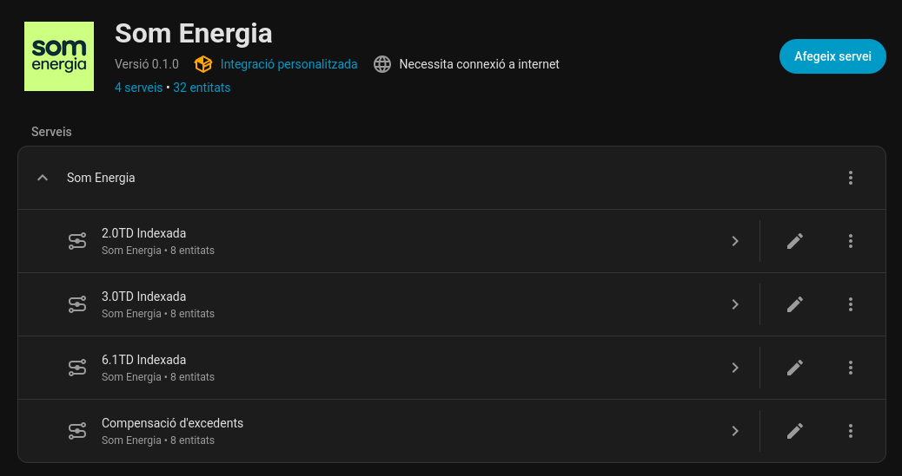
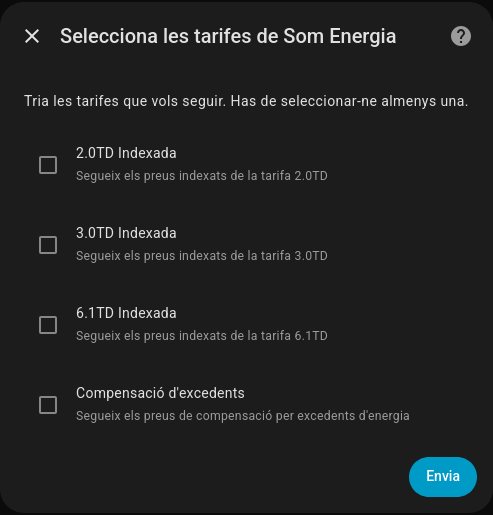
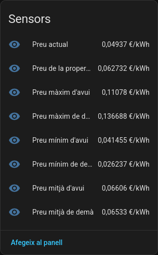

# ⚡ Som Energia for Home Assistant

Custom integration that fetches indexed electricity prices and surplus compensation values from Som Energia's public API and exposes them as Home Assistant sensors.

<picture>
  <source media="(prefers-color-scheme: dark)" srcset="media/integration.png" />
  <source media="(prefers-color-scheme: light)" srcset="media/integration_light.png" />
  
</picture>

## Features
- 🔢 Up to **8 sensors per selected tariff/compensation device** (current, next hour, today min/max/avg, tomorrow min/max/avg); each tariff/compensation is grouped as its own device for clarity.
- 📡 Supports multiple tariffs simultaneously (2.0TD, 3.0TD, 6.1TD) plus surplus compensation, each with their own 8-sensor set.
- 🔄 Data fetched daily at 18:00 UTC with retry handling; hourly refresh pushes state updates without re-fetching.
- ✅ Config flow validates API connectivity during setup.

> Note: Other Som Energia integrations typically expose a single indexed price and a handful of sensors. This one groups a full 8-sensor set per tariff/compensation entry.

## 🚀 Installation (HACS recommended)

1. Open **HACS** in your Home Assistant instance.
2. Go to **Integrations**.
3. Click the **⋮** (three dots) and choose **Custom repositories**.
4. Add this repository URL: `https://github.com/elboletaire/ha-somenergia`.
5. Select category **Integration** and click **Add**.
6. Find **Som Energia** in the list and install it.
7. Restart Home Assistant.

### Manual installation
1. Copy `custom_components/som_energia` into your Home Assistant `custom_components` directory.
2. Restart Home Assistant.

## Configuration
<picture>
  <source media="(prefers-color-scheme: dark)" srcset="media/selector.png" />
  <source media="(prefers-color-scheme: light)" srcset="media/selector_light.png" />
  
</picture>

1. In Home Assistant, go to *Settings → Devices & Services → Add Integration* and search for **Som Energia**.
2. Choose at least one tariff and/or the compensation option. The flow tests API connectivity before finishing.
3. Sensors are grouped per selected tariff and use unique IDs, so you can add multiple tariff combinations as separate config entries.

## Sensors
<picture>
  <source media="(prefers-color-scheme: dark)" srcset="media/sensors.png" />
  <source media="(prefers-color-scheme: light)" srcset="media/sensors_light.png" />
  
</picture>

- Each selected tariff/compensation creates its own device grouping with 8 sensors:
  - Current price, Next hour price
  - Today min/max/avg
  - Tomorrow min/max/avg

## Notes
- Minimum Home Assistant version: 2024.7.0 (uses `ConfigEntry.runtime_data`).
- Integration type: cloud polling; no authentication required.
- If the API temporarily fails, previous values are preserved and retries are scheduled automatically.
- Made with ❤️ for the Home Assistant community.
